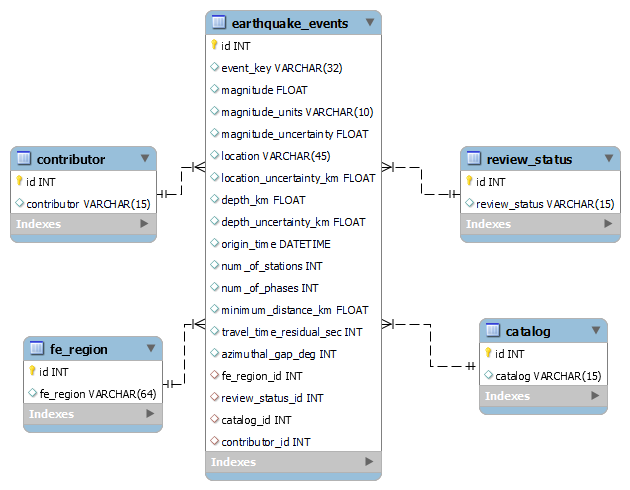

#### Project authors:
Rony Gozes, Marina Goldman

# Web scraping project
The program retrieves available information from USGS Natural Hazard website:

https://www.usgs.gov/natural-hazards

The website includes information on the latest earthquakes occurred in the last 24 hours worldwide with magnitude above 2.5.
The program adds new data into sql database.

## Web page for latest updates
https://earthquake.usgs.gov/earthquakes/map

## Framework
### Web-driver 
The program uses Chrome driver that should be downloaded from website
[chrome driver ](https://chromedriver.chromium.org/downloads).
Relevant download should be performed according to your OS. 
You should check your Chrome version.

### SQL database
The program uses MySQL database.

## Main program objective
The program scrapes from "the latest updates" page urls for individual events (earthquakes).
The program receives arguments from command line to customize scrapping  and addition to sql database process.
Each url is scraped for relevant data. The data is parsed, inserted into table, cleaned and cast to relevant datatype.
New data is saved in several tables in SQL database.

## Command line arguments
The user may define search criteria of minimal magnitude and hours for search back (1-24).

The user may define batch size for committing to sql database and number of iterations for sending web requests.

For all parameters default values are set so these parameters are not mandatory as user's input.

## Main steps for scraping:
1. Get main page using selenium.
2. Select event elements.
3. Click programmatically on each event element.
4. Select pop-up element and get url text from each.
5. On each scrapping check is done with text file to ensure this url was not downloaded already.
6. Modify url in order to get to origin/details page of each event. This page contains the relevant information.
7. Get each url page using selenium.
8. Select relevant information each page.
9. Parse received data and add into dictionary.
10. Convert list of dictionaries for all elements to pandas dataframe.
11. Process data and cast datatype when possible.


## Details on data process and cleaning before entering SQL database
1. Units were removed from values and added to column names.
2. As magnitude includes different units (different scale was used), created separate column to store the units. According to published reference all magnitude scales should yield approximately the same value of any given earthquake. 
3. Magnitude, Location and Depth fields were split with their uncertainty values to create two separate columns e.g., 'magnitude' and 'magnitude_uncertainty'.
4. 'Location Source' and 'Magnitude Source' fields from the website - decided not to add to database as include the same information as 'catalog'
5. Assigned numeric and datetime datatype to columns where it was possible.

## Main steps for saving in SQL database:
1. Convert each row of dataframe into "event" dictionary.
2. Perform check that there are no duplicates in the scrapped list.
3. Create new database (if it does not exist).
4. Create new tables (if they do not exist) with relevant columns (see ERD). Column names are identical to key names of dictionary.
5. As first step, add the data to the secondary tables (contributor, review_status, catalog, fe_region) via separate functions and instead of data values relevant IDs are obtained from these tables. These IDs replace the original values in the event dictionary.
6. As second step, add the updated dictionary to the main table - 'earthquake_events'.
7. Perform commit to sql according to defined batch size - number of events after which one commit is performed.
8. Perform final commit at the end of script to cover last events added after the most recent commit. 

## Entity Relationship Diagram (ERD) of SQL database



### Challenges
As the webpage is loading some elements are missing which caused us to get various errors.
To deal with this problem we used selenium package in order to wait for all elements to load properly and select them after they are in the DOM.
As several elements still were not completely uploaded on individual event scrapping, we added 'sleep=0.5' command to allow complete data upload to the webpage.
In addition, selenium was used in order to mimic human behaviour of clicking buttons.

```buildoutcfg
# Data scraping performed on Chrome browser.
driver = webdriver.Chrome()
driver.get(main_url)

# Selenium used for click, wait for page load and select relevant elements.
elements = driver.find_elements(By.TAG_NAME, 'mat-list-item')
driver.execute_script('arguments[0].click()', elements[1])
link = WebDriverWait(driver, timeout=3).until(lambda d: d.find_elements(By.CSS_SELECTOR, 'a.ng-tns-c101-0'))[-1]
```

Each user needs to define his MySql connection user_name and password. We solved it by keeping external file "personal.py" with constants 
USER and PASSWORD that hold personal connection details (the file is not shared). This file is imported to sql.py script and used in each function that required connection to MySQL.

```buildoutcfg
with pymysql.connect(host=sql_config.HOST, user=USER, password=PASSWORD) as connection:
    with connection.cursor() as cursor:
```

## Script files of this project

 - main.py
 - args_parser.py
 - scraper.py 
 - clean_data.py
 - sql.py
 - configs folder that includes config files for each script
 