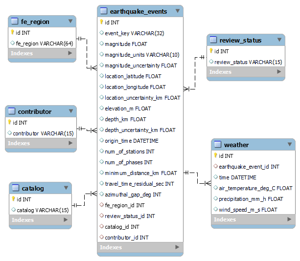

#### Project authors:

Rony Gozes, Marina Goldman

# Web scraping project
The program retrieves available information from USGS Natrual Hazard website:

https://www.usgs.gov/natural-hazards

The website includes information on the latest earthquakes occurred in last 24 hours worldwide with magnitude above 2.5.
The program organizes the data in table format with relevant datatype.

## Web page for latest updates
https://earthquake.usgs.gov/earthquakes/map

## Web-driver 
The program uses Chrome driver that should be downloaded from website
[chrome driver ](https://chromedriver.chromium.org/downloads).
Relevant download should be performed according to your OS. 
You should check your Chrome version.

## Main program objective
The program scrapes from "the latest updates" page urls for individual events (earthquakes).
The program receives arguments from command line to customize scrapping process.
Each url is scraped for relevant data. The data is parsed, inserted into table, cleaned and cast to relevant datatype.
The data is saved in SQL database.

## Command line arguments

## Main steps for scraping:
1. Get main page using selenium.
2. Select event elements.
3. Click programmatically on each event element.
4. Select pop-up element and get url text from each.
5. Urls are saved in txt file in order to avoid duplicate downloading. 
6. On each scrapping check is done with text file to ensure this url was not downloaded already.
7. Modify url in order to get to origin/details page of each event. This page contains the relevant information.
8. Get each url page using selenium.
9. Select relevant information each page.
10. Parse received data and add into dictionary.
11. Convert list of dictionaries for all elements to pandas dataframe.
12. Process data and cast datatype when possible.


## Main steps for saving in SQL database:
1. Each row of dataframe is converted into "event" dictionary.
2. New database is created.
3. New tables are defined with relevant columns (see ERD). Column names are identical to column names of dataframe.
4. 'Location Source' and 'Magnitude Source' fields from the website, decided not to add to database as include the same information as 'catalog'
5. As first step, the data is added to the secondary tables (contributor, review_status, catalog, fe_region) via separate functions and instead of data values relevant IDs are obtained from these tables and repalce the original values in the event dictionary.
6. As second step, the updated dictionary is entered to the main table - 'earthquake_events'.
7. Commit to sql tables is performed according to defined batch size -number of events after which one commit is performed.
8. At the end of script final commit is donne to cover last events added after the most recent commit. 

## Entity Relationship Diagram (ERD) of SQL database



### Challenges
As the webpage is loading some elements are missing which caused us to get various errors.
To deal with this problem we used selenium package in order to wait for all elements to load properly and select them after they are in the DOM.
As several elements still were not completely uploaded on individual event scrapping, we added 'sleep=0.5' command to allow complete data upload to the webpage.
In addition, selenium was used in order to mimic human behaviour of clicking buttons.

```buildoutcfg
# Data scraping performed on Chrome browser.
driver = webdriver.Chrome()
driver.get(main_url)

# Selenium used for click, wait for page load and select relevant elements.
elements = driver.find_elements(By.TAG_NAME, 'mat-list-item')
driver.execute_script('arguments[0].click()', elements[1])
link = WebDriverWait(driver, timeout=3).until(lambda d: d.find_elements(By.CSS_SELECTOR, 'a.ng-tns-c101-0'))[-1]
```
